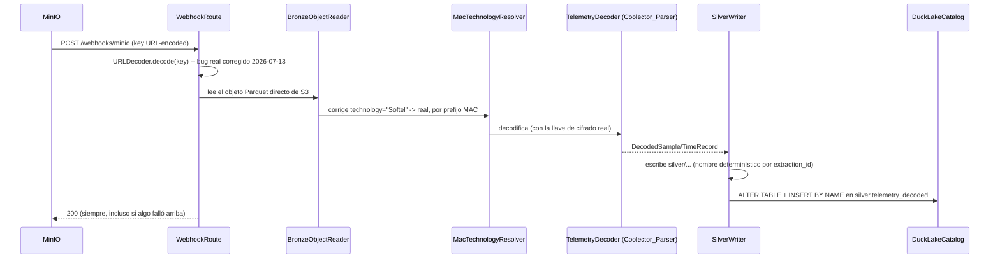

# lakehouse-parser-service — Architecture

**Scope:** cómo funciona este servicio — estructura, flujo Bronze→Silver, decodificación,
contrato con el resto del pipeline del Data Lakehouse. Para estado de desarrollo/pendientes
ver `docs/ai/service-context.md`.

---

## 1. Qué hace y dónde vive en el pipeline

Decodifica telemetría Bronze cruda (BLE, aún cifrada/en hex) usando la librería
`Coolector_Parser` (KMP) y escribe el resultado ya decodificado a `silver/`. Equivalente
local a `cool-parser` (Go) del sistema original.

**Aislamiento real, no solo de código:** es la **única** pieza de todo el Lakehouse con
acceso a la llave de descifrado `ImberaLinkCipher`. Si `lakehouse-silver-service`
(analytics, aguas abajo) se compromete, nunca tuvo acceso a esa llave — separación
deliberada que replica cómo el sistema original (`cool-parser`/`solkos-in-process-analytics`)
también separa decode de analytics en dos Cloud Functions independientes.

```
MinIO bucket "bronze"
      │  notificación (s3:ObjectCreated:*, evento sobre "bronze")
      ▼
lakehouse-parser-service :8082 (este repo)
      │
      ├─► Coolector_Parser (decodifica, usa la llave de cifrado)
      │
      ├─► MinIO bucket "silver" (Parquet ya decodificado)
      │
      └─► catálogo DuckLake — silver.telemetry_decoded (incremental)
                                          │
                                          ▼
                          (notificación sobre "silver" dispara lakehouse-silver-service)
```

Nunca lee la tabla DuckLake `bronze.telemetry_readings` — lee **directo el objeto Parquet**
que el evento de MinIO indica (`read_parquet('s3://bronze/<key>')`). Esto elimina una race
condition real: el sync a esa tabla (`DuckLakeSync`, en `lakehouse-ingestion-api`) es async y
best-effort, así que depender de ella introduciría una condición de carrera entre "¿ya
sincronizó?" y "¿ya llegó el webhook?".

## 2. Estructura del código

`src/main/kotlin/com/emerald/lakehouse/parser/`:

| Responsabilidad | Archivo |
|---|---|
| `main()` + módulo Ktor | `Application.kt` |
| Orquesta el flujo completo por objeto | `ParserPipeline.kt` |
| Lee el objeto Parquet Bronze directo de S3 | `bronze/BronzeObjectReader.kt` |
| Config desde env vars | `config/AppConfig.kt` |
| Deriva la llave real de cifrado a partir de 2 archivos | `decode/CipherKeyLoader.kt` |
| Algoritmo de deobfuscación (duplicado del SDK, sin tocarlo) | `decode/KeystreamDeobfuscator.kt` |
| Invoca `Coolector_Parser` para decodificar | `decode/TelemetryDecoder.kt` |
| Escribe/actualiza `silver.telemetry_decoded` en el catálogo | `duckdb/DuckLakeCatalog.kt` |
| `GET /health` | `routes/HealthRoute.kt` |
| `GET /metrics` (Prometheus) | `routes/MetricsRoute.kt` |
| `POST /webhooks/minio` | `routes/WebhookRoute.kt` |
| Escribe Parquet decodificado a `silver/`, idempotente por `extraction_id` | `silver/SilverWriter.kt` |
| Corrige el placeholder `"Softel"` → tecnología real por prefijo MAC | `technology/MacTechnologyResolver.kt` |
| Parseo del payload de notificación de MinIO | `webhooks/MinioNotification.kt` |

## 3. Endpoints

- **`GET /health`** — liveness.
- **`GET /metrics`** — Prometheus/Micrometer. Nunca pasa por nginx/mTLS.
- **`POST /webhooks/minio`** — notificación de bucket sobre `bronze` (`s3:ObjectCreated:*`).
  **Siempre responde `200`**, incluso si el pipeline falla internamente (decisión deliberada:
  evita que MinIO reintente en bucle indefinidamente). El manejo de fallos reales es
  observabilidad (logs/métricas), no reintento automático — ver `service-context.md` para el
  trade-off documentado.

## 4. Flujo de decodificación (`ParserPipeline`)



**`MacTechnologyResolver` — por qué existe:** el SDK manda `technology="Softel"` (placeholder
de formulario, `AppConfig.kt` del SDK) en vez del valor real. Sin corregirlo, dos cosas
fallan: la partición de Silver queda mal etiquetada, **y** `FirmwareProfileResolver` (en
`Coolector_Parser`) solo reconoce los strings exactos `"ELTEC"`/`"Villa"` para despachar a
esos decoders — cualquier dispositivo ELTEC/Villa real caería silenciosamente en el decoder
de ImberaLink. Se aplica **antes** de decodificar, tabla de prefijos MAC (OUI) portada de
`fn.py` del sistema original.

**`CipherKeyLoader` — la llave real, derivada de 2 archivos, no 1.** La llave de
`ImberaLinkCipher` (firmwares v136/v621) no es directamente `PARSER_CIPHER_KEY_PATH` — ese
archivo es solo la **semilla** (`parsingKey`). La llave real se deriva localmente
combinándola con `PARSER_IMBERA_BLOB_PATH` (el blob `IMBERA_KEY_BLOB`) vía
`KeystreamDeobfuscator` — el mismo algoritmo que usa `Coolector-SDK` internamente
(`CoreSecrets.initParsing`), duplicado aquí sin tocar el SDK. Best-effort: sin la llave, el
servicio sigue decodificando firmwares no cifrados (v126) sin tumbar el arranque.

## 5. Idempotencia (`SilverWriter`)

Nombre de archivo **determinístico por `extraction_id`** (no solo `device_id` — a diferencia
de `GoldWriter` en `lakehouse-silver-service`, que sí puede usar solo `device_id` porque
recalcula el historial completo en cada corrida; este servicio escribe una extracción por
invocación, no un recompute completo) + `DELETE` antes de `INSERT` en
`silver.telemetry_decoded`. Necesario porque MinIO puede reentregar el mismo evento
(redelivery) — sin esto, una redelivery duplicaría filas.

## 6. Configuración (env vars)

| Variable | Default | Notas |
|---|---|---|
| `MINIO_ENDPOINT` | `minio:9000` | |
| `BRONZE_BUCKET_NAME` | `bronze` | |
| `SILVER_BUCKET_NAME` | `silver` | |
| `PORT` | `8082` | |
| `DUCKLAKE_CATALOG_*` | ver `postgres-credentials` | |
| `PARSER_CIPHER_KEY_PATH` | `/etc/lakehouse-mtls/parser-cipher-key` | solo la semilla, ver §4 |
| `PARSER_IMBERA_BLOB_PATH` | `/etc/lakehouse-mtls/parser-imbera-blob` | el blob real, ver §4 |

Depende de `com.emerald.coolector:coolector-parser` (GitHub Packages, requiere PAT
`read:packages` como BuildKit secret para el build de Docker).

## 7. Build y despliegue

Mismo stack que `lakehouse-ingestion-api`/`lakehouse-silver-service` (Kotlin `2.3.0`, Ktor
`3.5.1`, Gradle `8.14.3`, JVM `17`). Corre en k3s como `Deployment` en el namespace
`lakehouse`, administrado por Terraform (`devops-lakehouse-local/terraform/`).
